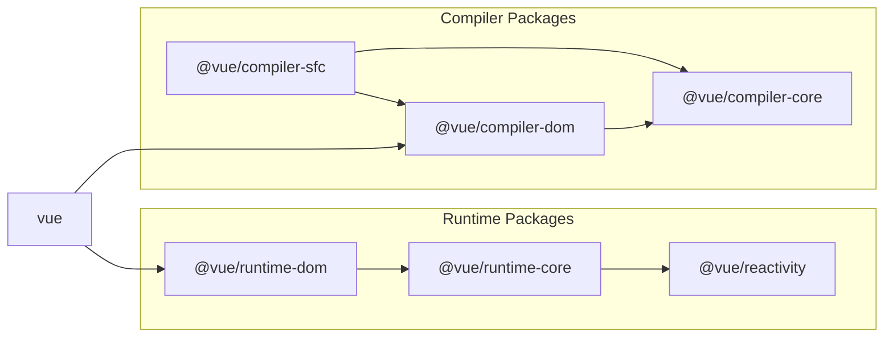

# 実はここまでで動作に必要なものは揃った(?)

これまで、リアクティブシステムや仮想 DOM、コンポーネントシステムなどを実装してきました。  
これらは非常に小さなもので、実用的なものではないのですが、実は動作に必要な構成要素の全体像としては一通り理解できたと言っても過言ではないのです。  
それぞれの要素自体の機能は足りていないですが、浅〜〜〜〜〜く 1 周した感じです。

このチャプターからはより Vue.js に近づけるためにテンプレートの機能を実装するのですが、これらはあくまで DX の改善のためのものであり、ランタイムに影響を出すものではありません。  
もう少し具体的にいうと、DX の向上のために開発者インターフェースを拡張し、「最終的には今まで作った内部実装に変換」します。

# 今回実現したい開発者インターフェース

今現時点ではこのような開発者インターフェースになっています。

```ts
const MyComponent: Component = {
  props: { someMessage: { type: String } },

  setup(props: any, { emit }: any) {
    return () =>
      h("div", {}, [
        h("p", {}, [`someMessage: ${props.someMessage}`]),
        h("button", { onClick: () => emit("click:change-message") }, [
          "change message",
        ]),
      ]);
  },
};

const app = createApp({
  setup() {
    const state = reactive({ message: "hello" });
    const changeMessage = () => {
      state.message += "!";
    };

    return () =>
      h("div", { id: "my-app" }, [
        h(
          MyComponent,
          {
            "some-message": state.message,
            "onClick:change-message": changeMessage,
          },
          []
        ),
      ]);
  },
});
```

現状だと、View の部分は h 関数を使って構築しています。より生の HTML に近づけるために template オプションに template を描けるようにしたいです。
とは言っても、いきなり色々モリモリで実装するのは大変なので、少し機能を絞って作ってみます。とりあえず、以下のようなタスクに分割してやっていきます。

1. 単純なタグとメッセージ、静的な属性を描画できるように

```ts
const app = createApp({ template: `<p class="hello">Hello World</p>` });
```

2. もう少し複雑な HTML を描画できるように

```ts
const app = createApp({
  template: `
    <div>
      <p>hello</p>
      <button> click me! </button>
    </div>
  `,
});
```

3. setup 関数で定義したものを使えるようにしたい

```ts
const app = createApp({
  setup() {
    const count = ref(0);
    const increment = () => {
      count.value++;
    };

    return { count, increment };
  },

  template: `
    <div>
      <p>count: {{ count }}</p>
      <button v-on:click="increment"> click me! </button>
    </div>
  `,
});
```

それぞれでさらに小さく分割はしていくのですが、おおまかにこの 3 ステップに分割してみます。
まずは 1 からやっていきましょう。

# テンプレートコンパイラの第一歩

さて、今回目指す開発者インターフェースは以下のようなものです。

```ts
const app = createApp({ template: `<p class="hello">Hello World</p>` });
```

ここでまず、コンパイラとはいったいなんなのかという話だけしておきます。  
ソフトウェアを書いているとたちまち「コンパイラ」という言葉を耳にするかと思います。  
「コンパイル」というのは翻訳という意味で、ソフトウェアの領域だとより高級な記述から低級な記述へ変換する際によくこの言葉を使います。
この本の最初の方のこの言葉を覚えているでしょうか?

> ここでは便宜上、生の JS に近ければ近いほど「低級な開発者インターフェース」と呼ぶことにします。  
> そして、ここで重要なのが、「実装を始めるときは低級なところから実装していく」ということです。  
> それはなぜかというと、多くの場合、高級な記述は低級な記述に変換されて動いているからです。  
> つまり、1 も 2 も最終的には内部的に 3 の形に変換しているのです。  
> その変換の実装のことを「コンパイラ (翻訳機)」と呼んでいます。

では、このコンパイラというものがなぜ必要なのかということについてですが、それは「開発体験を向上させる」というのが大きな目的の一つです。  
最低限、動作するような低級なインターフェースが備わっていれば、機能としてはそれらだけで開発を進めることは可能です。  
ですが、記述がわかりづらかったり、機能に関係のない部分を考慮する必要が出てきたりと色々と面倒な問題がでてくるのはしんどいので、利用者の気持ちを考えてインターフェースの部分だけを再開発します。

この点で、Vue.js が目指している点は、「生の HTML のように書けかつ、Vue が提供する機能(ディレクティブなど)を活用して便利に View を書く」と言ったところでしょうか。
そして、そこの行き着く先が SFC といったところでしょうか。
昨今では jsx/tsx の流行もあり、Vue はもちろんこれらも開発者インターフェースの選択肢として提供しています。が、今回は Vue 独自の template を実装する方向でやってみようと思います。

長々と、文章で説明してしまいましたが、結局今回やりたいことは、

このようなコードを、

```ts
const app = createApp({ template: `<p class="hello">Hello World</p>` });
```

このように翻訳(コンパイル)する機能を実装したいです。

```ts
const app = createApp({
  render() {
    return h("p", { class: "hello" }, ["Hello World"]);
  },
});
```

もう少しスコープを狭めるなら、この部分です。

```ts
`<p class="hello">Hello World</p>`;
// ↓
h("p", { class: "hello" }, ["Hello World"]);
```

いくつかのフェーズに分けて、段階的に実装を進めていきましょう。

# 小さいコンパイラを実装してみる。

## 実装アプローチ

基本的なアプローチとしては、template オプションでで渡された文字列を操作して特定の関数を生成する感じです。  
コンパイラを３つの要素に分割してみます。

### 解析

解析(parse)は渡された文字列から必要な情報を解析します。以下のようなイメージをしてもらえれば OK です。

```ts
const { tag, props, textContent } = parse(`<p class="hello">Hello World</p>`);
console.log(tag); // "p"
console.log(prop); // { class: "hello" }
console.log(textContent); // "Hello World"
```

### コード生成

コード生成(codegen)では parse の結果をもとにコード(文字列)を生成します。

```ts
const code = codegen({ tag, props, textContent });
console.log(code); // "h('p', { class: 'hello' }, ['Hello World']);"
```

### 関数オブジェクト生成

codegen で生成したコード(文字列)をもとに実際に実行可能な関数を生成します。
JavaScript では、Function コンストラクタを利用することで文字列から関数を生成することが可能です。

```ts
const f = new Function("return 1");
console.log(f()); // 1

// 引数を定義する場合はこんな感じ
const add = new Function("a", "b", "return a + b");
console.log(add(1, 1)); // 2
```

これを利用して関数を生成します。
ここで一点注意点があるのですが、生成した関数はその中で定義された変数しか扱うことができないので、h 関数などの読み込みもこれに含んであげます。

```ts
import * as runtimeDom from "./runtime-dom";
const render = new Function("ChibiVue", code)(runtimeDom);
```

こうすると、ChibiVue という名前で runtimeDom を受け取ることができるので、codegen の段階で以下のように h 関数を読み込めるようにしておきます。

```ts
const code = codegen({ tag, props, textContent });
console.log(code); // "return () => { const { h } = ChibiVue; return h('p', { class: 'hello' }, ['Hello World']); }"
```

つまり、先ほど、

```ts
`<p class="hello">Hello World</p>`;
// ↓
h("p", { class: "hello" }, ["Hello World"]);
```

のように変換すると言いましたが、正確には、

```ts
`<p class="hello">Hello World</p>`;

// ↓

(ChibiVue) => {
  return () => {
    const { h } = ChibiVue;
    return h("p", { class: "hello" }, ["Hello World"]);
  };
};
```

のように変換し、runtimeDom を渡して render 関数を生成します。
そして、codegen の責務は

```ts
const code = `
  return () => {
      const { h } = ChibiVue;
      return h("p", { class: "hello" }, ["Hello World"]);
  };
`;
```

という文字列を生成することです。

# 実装

アプローチが理解できたら早速実装してみましょう。`~/packages/src`に`compiler-core`というディレクトリを作ってそこに`index.ts`, `parse.ts`, `codegen.ts`を作成します。

```sh
pwd # ~/
mkdir packages/compiler-core
touch packages/compiler-core/index.ts
touch packages/compiler-core/parse.ts
touch packages/compiler-core/codegen.ts
```

index.ts は例の如く export するためだけに利用します。

それでは parse から実装していきましょう。
`packages/compiler-core/parse.ts`

```ts
export const baseParse = (
  content: string
): { tag: string; props: Record<string, string>; textContent: string } => {
  const matched = content.match(/<(\w+)\s+([^>]*)>([^<]*)<\/\1>/);
  if (!matched) return { tag: "", props: {}, textContent: "" };

  const [_, tag, attrs, textContent] = matched;

  const props: Record<string, string> = {};
  attrs.replace(/(\w+)=["']([^"']*)["']/g, (_, key: string, value: string) => {
    props[key] = value;
    return "";
  });

  return { tag, props, textContent };
};
```

正規表現を使った非常に簡素なパーサではありますが、初めての実装としては十分です。

続いて、コードの生成です。codegen.ts に実装していきます。
`packages/compiler-core/codegen.ts`

```ts
export const generate = ({
  tag,
  props,
  textContent,
}: {
  tag: string;
  props: Record<string, string>;
  textContent: string;
}): string => {
  return `return () => {
  const { h } = ChibiVue;
  return h("${tag}", { ${Object.entries(props)
    .map(([k, v]) => `${k}: "${v}"`)
    .join(", ")} }, ["${textContent}"]);
}`;
};
```

それでは、これらを組み合わせて template から関数の文字列を生成する関数を実装します。`packages/compiler-core/compile.ts`というファイルを新たに作成します。
`packages/compiler-core/codegen.ts`

```ts
import { generate } from "./codegen";
import { baseParse } from "./parse";

export function baseCompile(template: string) {
  const parseResult = baseParse(template);
  const code = generate(parseResult);
  return code;
}
```

特に難しくないかと思います。実は、compiler-core の責務はここまでです。

# ランタイム上のコンパイラとビルドプロセスのコンパイラ

実は Vue にはコンパイラが 2 種類存在しています。  
それは、ランタイム上(ブラウザ上)で実行されるものと、ビルドプロセス上(Node.js など)で実行されるものです。  
具体的には、ランタイムの方は template オプションまたは html として与えられるテンプレートのコンパイラ、ビルドプロセス上は SFC(や jsx)のコンパイラです。  
template オプションとはちょうど今我々が実装しているものです。

```ts
const app = createApp({ template: `<p class="hello">Hello World</p>` });
app.mount("#app");
```

```html
<div id="app"></div>
```

html として与えられるテンプレートというのは html に Vue の template を書くような開発者インターフェースです。(CDN 経由などでサクッと HTML に盛り込むのに便利です。)

```ts
const app = createApp();
app.mount("#app");
```

```html
<div id="app">
  <p class="hello">Hello World</p>
  <button @click="() => alert("hello")">click me!</button>
</div>
```

これら 2 つはどちらも template をコンパイルする必要がありますが、コンパイルはブラウザ上で実行されます。

一方で、SFC のコンパイルはプロジェクトのビルド時に行われ、ランタイム上にはコンパイル後のコードしか存在していません。(開発環境に vite や webpack 等のバンドラを用意する必要があります。)

```vue
<!-- App.vue -->
<script>
export default {}
</script>

<template>
  <p class="hello">Hello World</p>
  <button @click="() => alert("hello")">click me!</button>
</template>
```

```ts
import App from "App.vue";
const app = createApp(App);
app.mount("#app");
```

```html
<div id="app"></div>
```

そして、注目するべき点はどっちのコンパイラにせよ、共通の処理という点です。  
この共通部分のソースコードを実装しているのが `compiler-core` ディレクトリです。  
そして、ランタイム上のコンパイラ、SFC コンパイラはそれぞれ`compiler-dom`, `compiler-sfc`というディレクトリに実装されています。  
ぜひ、ここらでこの図を見返してみてください。



https://github.com/vuejs/core/blob/main/.github/contributing.md#package-dependencies

# 実装の続き

少し話が飛んでしまいましたが、実装の続きをやっていきましょう。
先ほどの話を考慮すると、今作っているのはランタイム上で動作するコンパイラなので、`compiler-dom`を作っていくのが良さそうです。

```sh
pwd # ~/
mkdir packages/compiler-dom
touch packages/compiler-dom/index.ts
```

`packages/compiler-dom/index.ts`に実装します。

```ts
import { baseCompile } from "../compiler-core";

export function compile(template: string) {
  return baseCompile(template);
}
```

「えっっっっ、これじゃあただ codegen しただけじゃん。関数の生成はどうするの？」と思ったかも知れません。  
実はここでも関数の生成は行なっておらず、どこで行うかというと`package/index.ts`です。(本家のコードで言うと [packages/vue/src/index.ts](https://github.com/vuejs/core/blob/main/packages/vue/src/index.ts) です)

`package/index.ts`を実装したいところですが、ちょいと下準備があるので先にそちらからやります。
その下準備というのは、`package/runtime-core/component.ts`にコンパイラ本体を保持する変数と、登録用の関数を実装です。

`package/runtime-core/component.ts`

```ts
type CompileFunction = (template: string) => InternalRenderFunction;
let compile: CompileFunction | undefined;

export function registerRuntimeCompiler(_compile: any) {
  compile = _compile;
}
```

それでは、`package/index.ts`で関数の生成をして、登録してあげましょう。

```ts
import { compile } from "./compiler-dom";
import {
  InternalRenderFunction,
  registerRuntimeCompiler,
} from "./runtime-core";
import * as runtimeDom from "./runtime-dom";

function compileToFunction(template: string): InternalRenderFunction {
  const code = compile(template);
  return new Function("ChibiVue", code)(runtimeDom);
}

registerRuntimeCompiler(compileToFunction);

export * from "./runtime-core";
export * from "./runtime-dom";
export * from "./reactivity";
```

※ runtimeDom には h 関数を含める必要があるので `runtime-dom`で export するのを忘れないようにしてください。

```ts
export { h } from "../runtime-core";
```

さて、コンパイラの登録ができたので実際にコンパイルを実行したいです。
コンポーネントのオプションの型に template がなくては始まらないのでとりあえず template は生やしておきます。

```ts
export type ComponentOptions = {
  props?: Record<string, any>;
  setup?: (
    props: Record<string, any>,
    ctx: { emit: (event: string, ...args: any[]) => void }
  ) => Function;
  render?: Function;
  template?: string; // 追加
};
```

肝心のコンパイルですが、renderer を少しリファクタする必要があります。

```ts
const mountComponent = (initialVNode: VNode, container: RendererElement) => {
  const instance: ComponentInternalInstance = (initialVNode.component =
    createComponentInstance(initialVNode));

  // ----------------------- ここから
  const { props } = instance.vnode;
  initProps(instance, props);
  const component = initialVNode.type as Component;
  if (component.setup) {
    instance.render = component.setup(instance.props, {
      emit: instance.emit,
    }) as InternalRenderFunction;
  }
  // ----------------------- ここまで

  setupRenderEffect(instance, initialVNode, container);
};
```

`mountComponent`の上記に示した部分を`package/runtime-core/component.ts`に切り出します。

`package/runtime-core/component.ts`

```ts
export const setupComponent = (instance: ComponentInternalInstance) => {
  const { props } = instance.vnode;
  initProps(instance, props);

  const component = instance.type as Component;
  if (component.setup) {
    instance.render = component.setup(instance.props, {
      emit: instance.emit,
    }) as InternalRenderFunction;
  }
};
```

`package/runtime-core/renderer.ts`

```ts
const mountComponent = (initialVNode: VNode, container: RendererElement) => {
  // prettier-ignore
  const instance: ComponentInternalInstance = (initialVNode.component = createComponentInstance(initialVNode));
  setupComponent(instance);
  setupRenderEffect(instance, initialVNode, container);
};
```

それでは、setupComponent 内でコンパイルを実行していきましょう。

```ts
export const setupComponent = (instance: ComponentInternalInstance) => {
  const { props } = instance.vnode;
  initProps(instance, props);

  const component = instance.type as Component;
  if (component.setup) {
    instance.render = component.setup(instance.props, {
      emit: instance.emit,
    }) as InternalRenderFunction;
  }

  // ------------------------ ここ
  if (compile && !component.render) {
    const template = component.template ?? "";
    if (template) {
      instance.render = compile(template);
    }
  }
};
```

これで template オプションで私た簡素な HTML がコンパイルできるようになったはずなので playground で試してみましょう！

```ts
const app = createApp({ template: `<p class="hello">Hello World</p>` });
app.mount("#app");
```


無事に動いているようです。同じ構造であればコンパイルできるはずなので、少しいじってみて反映されるか確認してみましょう。

```ts
const app = createApp({
  template: `<b class="hello" style="color: red;">Hello World!!</b>`,
});
app.mount("#app");
```


ちゃんと実装できているようです！

ここまでのソースコード:  
https://github.com/Ubugeeei/chibivue/tree/main/books/chapter_codes/07-1_mininum_template_compiler

# もっと複雑な HTML を書きたい

今の状態だとせいぜいタグの名前や属性を、テキストの内容くらいしか表すことができていません。  
そこで、もっと複雑な HTML を template に書けるようにしたいです。
具体的には、これくらいのテンプレートをコンパイルできるようになりたいです。

```ts
const app = createApp({
  template: `
    <div class="container" style="text-align: center">
      <h2>Hello, chibivue!</h2>
      
      <p><b>chibivue</b> is the minimal Vue.js</p>

      <style>
        .container {
          height: 100vh;
          padding: 16px;
          background-color: #becdbe;
          color: #2c3e50;
        }
      </style>
    </div>

  `,
});
app.mount("#app");
```

しかしこれだけ複雑なものは正規表現でパースするのは厳しいのです。なので、ここからは本格的にパーサを実装していこうと思います。

# AST の導入

本格的なコンパイラを実装していくにあたって AST というものを導入します。  
AST は Abstract Syntax Tree (抽象構文木)の略で、名前の通り、構文を表現する木構造のデータ表現です。  
これは、Vue.js に限らず、さまざまなコンパイラを実装するときに登場する概念です。  
多くの場合(言語処理系においては)、「パース」というと、この AST という表現に変換することを指します。  
AST の定義はそれぞれの言語が各自で定義します。  
例えば、皆さんが馴染み深いであろう JavaScript は [estree](https://github.com/estree/estree) という AST で表現されていて、内部的にはソースコードの文字列がこの定義に沿ってパースされていたりします。

と、少しかっこいい感じの説明をしてみましたが、イメージ的にはこれまで実装していた parse 関数の戻り値の型をもっとかっちり形式的に定義するだけです。
今現状だと、parse 関数の戻り値は以下のようになっています。

```ts
type ParseResult = {
  tag: string;
  props: Record<string, string>;
  textContent: string;
};
```

これを拡張して、もっと複雑な表現を行えるような定義にしてみます。

新たに `~/packages/compiler-core/ast.ts` を作成します。  
少し長いので、コード中に説明を書きながら説明を進めます。

```ts
// これは Node の種類を表すものです。
// 注意するべき点としては、ここでいう Node というのは HTML の Node のことではなく、あくまでこのテンプレートコンパイラで扱う粒度であるということです。
// なので、 Element やTextだけでなく Attribute も一つの Node として扱われます。
// これは Vue.js の設計に沿った粒度で、今後、ディレクティブを実装する際などに役に立ちます。
export const enum NodeTypes {
  ELEMENT,
  TEXT,
  ATTRIBUTE,
}

// 全ての Node は type と loc を持っています。
// loc というのは location のことで、この Node がソースコード(テンプレート文字列)のどこに該当するかの情報を保持します。
// (何行目のどこにあるかなど)
export interface Node {
  type: NodeTypes;
  loc: SourceLocation;
}

// Element の Node です。
export interface ElementNode extends Node {
  type: NodeTypes.ELEMENT;
  tag: string; // eg. "div"
  props: Array<AttributeNode>; // eg. { name: "class", value: { content: "container" } }
  children: TemplateChildNode[];
  isSelfClosing: boolean; // eg.  -> true
}

// ElementNode が持つ属性です。
// ただの Record<string, string> と表現してしまってもいいのですが、
// Vue に倣って name(string) と value(TextNode) を持つようにしています。
export interface AttributeNode extends Node {
  type: NodeTypes.ATTRIBUTE;
  name: string;
  value: TextNode | undefined;
}

export type TemplateChildNode = ElementNode | TextNode;

export interface TextNode extends Node {
  type: NodeTypes.TEXT;
  content: string;
}

// location の情報です。 Node はこの情報を持ちます。
// start, end に位置情報が入ります。
// source には実際のコード(文字列)が入ります。
export interface SourceLocation {
  start: Position;
  end: Position;
  source: string;
}

export interface Position {
  offset: number; // from start of file
  line: number;
  column: number;
}
```

これらが今回扱う AST です。  
parse 関数では template の文字列をこの AST に変換するような実装をしていきます。

# 本格的なパーサの実装

`~/packages/compiler-core/parse.ts` に本格的な実装していきます。  
本格的と言ってもあまり身構えなくて大丈夫です。やっていることは基本的に文字列を読み進めながら分岐やループを活用して AST を生成しているだけです。  
ソースコードが少し多くなりますが、説明もコードベースの方が分かりやすいと思うのでそう進めていきます。  
細かい部分はぜひソースコードを読んで把握してみてください。

今実装してある baseParse の内容は一旦消して、戻り値の型も以下のようにします。

```ts
import { TemplateChildNode } from "./ast";

export const baseParse = (
  content: string
): { children: TemplateChildNode[] } => {
  // TODO:
  return { children: [] };
};
```

## Context

まずは parse する際に使う状態から実装します。これは `ParserContext`という名前をつけて、パース中に必要な情報をここにまとめます。ゆくゆくはパーサーの設定オプションなども保持するようになると思います。

```ts
export interface ParserContext {
  // 元々のテンプレート文字列
  readonly originalSource: string;

  source: string;

  // このパーサが読み取っている現在地
  offset: number;
  line: number;
  column: number;
}

function createParserContext(content: string): ParserContext {
  return {
    originalSource: content,
    source: content,
    column: 1,
    line: 1,
    offset: 0,
  };
}

export const baseParse = (
  content: string
): { children: TemplateChildNode[] } => {
  const context = createParserContext(content); // contextを生成

  // TODO:
  return { children: [] };
};
```

## parseChildren

順番的には、(parseChildren) -> (paseElement または parseText)とパースを進めていきます。

少し長いですが、parseChildren の実装からです。説明はソースコード中のコメントアウトで行います。

```ts
export const baseParse = (
  content: string
): { children: TemplateChildNode[] } => {
  const context = createParserContext(content);
  const children = parseChildren(context, []); // 子ノードをパースする
  return { children: children };
};

function parseChildren(
  context: ParserContext,

  // HTMLは再起的な構造を持っているので、祖先要素をスタックとして持っておいて、子にネストして行くたびにpushしていきます。
  // endタグを見つけるとparseChildrenが終了してancestorsをpopする感じです。
  ancestors: ElementNode[]
): TemplateChildNode[] {
  const nodes: TemplateChildNode[] = [];

  while (!isEnd(context, ancestors)) {
    const s = context.source;
    let node: TemplateChildNode | undefined = undefined;

    if (s[0] === "<") {
      // sが"<"で始まり、かつ次の文字がアルファベットの場合は要素としてパースします。
      if (/[a-z]/i.test(s[1])) {
        node = parseElement(context, ancestors); // TODO: これから実装します。
      }
    }

    if (!node) {
      //　上記の条件に当てはまらなかった場合位はTextNodeとしてパースします。
      node = parseText(context); // TODO: これから実装します。
    }

    pushNode(nodes, node);
  }

  return nodes;
}

// 子要素パースの while を判定(パース終了)するための関数
function isEnd(context: ParserContext, ancestors: ElementNode[]): boolean {
  const s = context.source;

  // sが"</"で始まり、かつその後にancestorsのタグ名が続くことを判定し、閉じタグがあるか(parseChildrenが終了するべきか)を判定します。
  if (startsWith(s, "</")) {
    for (let i = ancestors.length - 1; i >= 0; --i) {
      if (startsWithEndTagOpen(s, ancestors[i].tag)) {
        return true;
      }
    }
  }

  return !s;
}

function startsWith(source: string, searchString: string): boolean {
  return source.startsWith(searchString);
}

function pushNode(nodes: TemplateChildNode[], node: TemplateChildNode): void {
  // nodeTypeがTextのものが連続している場合は結合してあげます
  if (node.type === NodeTypes.TEXT) {
    const prev = last(nodes);
    if (prev && prev.type === NodeTypes.TEXT) {
      prev.content += node.content;
      return;
    }
  }

  nodes.push(node);
}

function last<T>(xs: T[]): T | undefined {
  return xs[xs.length - 1];
}

function startsWithEndTagOpen(source: string, tag: string): boolean {
  return (
    startsWith(source, "</") &&
    source.slice(2, 2 + tag.length).toLowerCase() === tag.toLowerCase() &&
    /[\t\r\n\f />]/.test(source[2 + tag.length] || ">")
  );
}
```

続いて parseElement と parseText について実装していきます。

## parseText

まずはシンプルな parseText の方から.一部、parseText 以外でも使うユーティリティも実装しているので少しだけ長いです。

```ts
function parseText(context: ParserContext): TextNode {
  // "<" (タグの開始(開始タグ終了タグ問わず))まで読み進め、何文字読んだかを元にTextデータの終了時点のindexを算出します。
  const endToken = "<";
  let endIndex = context.source.length;
  const index = context.source.indexOf(endToken, 1);
  if (index !== -1 && endIndex > index) {
    endIndex = index;
  }

  const start = getCursor(context); // これは loc 用

  //　entIndexの情報を元に Text データをパースします。
  const content = parseTextData(context, endIndex);

  return {
    type: NodeTypes.TEXT,
    content,
    loc: getSelection(context, start),
  };
}

// content と length を元に text を抽出します。
function parseTextData(context: ParserContext, length: number): string {
  const rawText = context.source.slice(0, length);
  advanceBy(context, length);
  return rawText;
}

// -------------------- 以下からはユーティリティです。(parseElementなどでも使う) --------------------

function advanceBy(context: ParserContext, numberOfCharacters: number): void {
  const { source } = context;
  advancePositionWithMutation(context, source, numberOfCharacters);
  context.source = source.slice(numberOfCharacters);
}

// 少し長いですが、やっていることは単純で、 pos の計算を行っています。
// 引数でもらった pos のオブジェクトを破壊的に更新しています。
function advancePositionWithMutation(
  pos: Position,
  source: string,
  numberOfCharacters: number = source.length
): Position {
  let linesCount = 0;
  let lastNewLinePos = -1;
  for (let i = 0; i < numberOfCharacters; i++) {
    if (source.charCodeAt(i) === 10 /* newline char code */) {
      linesCount++;
      lastNewLinePos = i;
    }
  }

  pos.offset += numberOfCharacters;
  pos.line += linesCount;
  pos.column =
    lastNewLinePos === -1
      ? pos.column + numberOfCharacters
      : numberOfCharacters - lastNewLinePos;

  return pos;
}

function getCursor(context: ParserContext): Position {
  const { column, line, offset } = context;
  return { column, line, offset };
}

function getSelection(
  context: ParserContext,
  start: Position,
  end?: Position
): SourceLocation {
  end = end || getCursor(context);
  return {
    start,
    end,
    source: context.originalSource.slice(start.offset, end.offset),
  };
}
```

# parseElement

続いて要素のパースです。  
要素のパースは主に start タグのパース、子 Node のパース、end タグのパースで成り立っていて、start タグのパースはさらにタグ名、属性に分かれます。  
まずは前半の start タグ, 子 Node, end タグをパースするガワを作っていきましょう。

```ts
const enum TagType {
  Start,
  End,
}

function parseElement(
  context: ParserContext,
  ancestors: ElementNode[]
): ElementNode | undefined {
  // Start tag.
  const parent = last(ancestors);
  const element = parseTag(context, TagType.Start); // TODO:

  //  のような self closing の要素の場合にはここで終了です。( children も end タグもないので)
  if (element.isSelfClosing) {
    return element;
  }

  // Children.
  ancestors.push(element);
  const children = parseChildren(context, ancestors);
  ancestors.pop();

  element.children = children;

  // End tag.
  if (startsWithEndTagOpen(context.source, element.tag)) {
    parseTag(context, TagType.End); // TODO:
  }

  return element;
}
```

とくに難しいことはないと思います。ここで parseChildren が再帰しています。(parseElement は parseChildren に呼ばれるので)  
前後で ancestors というスタック構造のデータを操作しています。

parseTag を実装していきます。

```ts
function parseTag(context: ParserContext, type: TagType): ElementNode {
  // Tag open.
  const start = getCursor(context);
  const match = /^<\/?([a-z][^\t\r\n\f />]*)/i.exec(context.source)!;
  const tag = match[1];

  advanceBy(context, match[0].length);
  advanceSpaces(context);

  // Attributes.
  let props = parseAttributes(context, type);

  // Tag close.
  let isSelfClosing = false;

  // 属性まで読み進めた時点で、次が "/>" だった場合は SelfClosing とする
  isSelfClosing = startsWith(context.source, "/>");
  advanceBy(context, isSelfClosing ? 2 : 1);

  return {
    type: NodeTypes.ELEMENT,
    tag,
    props,
    children: [],
    isSelfClosing,
    loc: getSelection(context, start),
  };
}

// 属性全体(複数属性)のパース
// eg. `id="app" class="container" style="color: red"`
function parseAttributes(
  context: ParserContext,
  type: TagType
): AttributeNode[] {
  const props = [];
  const attributeNames = new Set<string>();
  s;

  // タグが終わるまで読み続ける
  while (
    context.source.length > 0 &&
    !startsWith(context.source, ">") &&
    !startsWith(context.source, "/>")
  ) {
    const attr = parseAttribute(context, attributeNames);

    if (type === TagType.Start) {
      props.push(attr);
    }

    advanceSpaces(context); // スペースは読み飛ばす
  }

  return props;
}

type AttributeValue =
  | {
      content: string;
      loc: SourceLocation;
    }
  | undefined;

// 属性一つのパース
// eg. `id="app"`
function parseAttribute(
  context: ParserContext,
  nameSet: Set<string>
): AttributeNode {
  // Name.
  const start = getCursor(context);
  const match = /^[^\t\r\n\f />][^\t\r\n\f />=]*/.exec(context.source)!;
  const name = match[0];

  nameSet.add(name);

  advanceBy(context, name.length);

  // Value
  let value: AttributeValue = undefined;

  if (/^[\t\r\n\f ]*=/.test(context.source)) {
    advanceSpaces(context);
    advanceBy(context, 1);
    advanceSpaces(context);
    value = parseAttributeValue(context);
  }

  const loc = getSelection(context, start);

  return {
    type: NodeTypes.ATTRIBUTE,
    name,
    value: value && {
      type: NodeTypes.TEXT,
      content: value.content,
      loc: value.loc,
    },
    loc,
  };
}

// 属性のvalueをパース
// valueのクォーとはシングルでもダブルでもパースできるように実装しています。
// これも頑張ってクォートで囲まれたvalueを取り出したりしているだけです。
function parseAttributeValue(context: ParserContext): AttributeValue {
  const start = getCursor(context);
  let content: string;

  const quote = context.source[0];
  const isQuoted = quote === `"` || quote === `'`;
  if (isQuoted) {
    // Quoted value.
    advanceBy(context, 1);

    const endIndex = context.source.indexOf(quote);
    if (endIndex === -1) {
      content = parseTextData(context, context.source.length);
    } else {
      content = parseTextData(context, endIndex);
      advanceBy(context, 1);
    }
  } else {
    // Unquoted
    const match = /^[^\t\r\n\f >]+/.exec(context.source);
    if (!match) {
      return undefined;
    }
    content = parseTextData(context, match[0].length);
  }

  return { content, loc: getSelection(context, start) };
}
```

# パーサの実装を終えて

例になくたくさんコードを書いてきました。(せいぜい 300 行ちょっとですが)  
ここの実装は特別言葉で説明するよりも読んだ方が理解が進むと思うので、何度か繰り返し読んでみてください。  
たくさん書きましたが基本的には文字列を読み進めて解析を進めているだけで、特に難しいテクニックなどはない地道な作業です。

ここまでで AST を生成できるようになっているはずです。パースができているか動作を確認してみましょう。
とはいえ、codegen の部分をまだ実装できていないので、今回に関しては console に出力して確認してみます。

```ts
const app = createApp({
  template: `
    <div class="container" style="text-align: center">
      <h2>Hello, chibivue!</h2>
      
      <p><b>chibivue</b> is the minimal Vue.js</p>

      <style>
        .container {
          height: 100vh;
          padding: 16px;
          background-color: #becdbe;
          color: #2c3e50;
        }
      </style>
    </div>
  `,
});
app.mount("#app");
```

`~/packages/compiler-core/compile.ts`

```ts
export function baseCompile(template: string) {
  const parseResult = baseParse(template.trim()); // templateはトリムしておく
  console.log(
    "🚀 ~ file: compile.ts:6 ~ baseCompile ~ parseResult:",
    parseResult
  );

  // TODO: codegen
  // const code = generate(parseResult);
  // return code;
  return "";
}
```

画面は何も表示されなくなってしまいますが、コンソールを確認してみましょう。


いい感じにパースができているようです。
それではここで生成した AST を元に codegen の方の実装を進めていこうと思います。

# 本格的なコードジェネレータの実装
